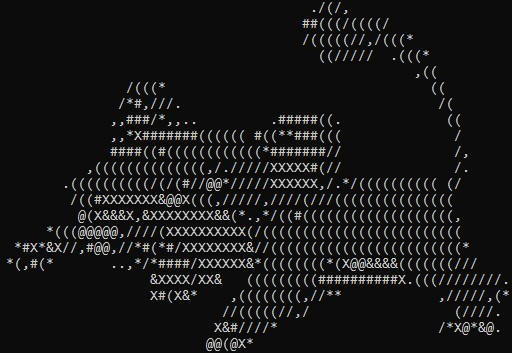
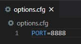
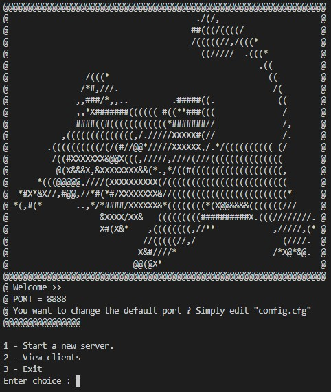
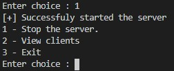
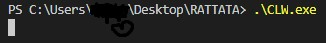
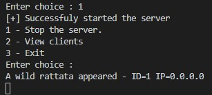
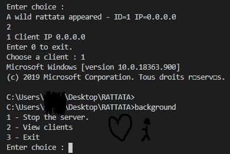

<div align="center">

</div>

About
-----

RATTATA is a Remote Administration Tool where clients are rattata.
For Windows only (even if the TCP connexion can be made from the Windows rattata (client) to anything else (AKA anotehr OS))

Prerequisites
-------------
Nothing.

Build
-----------------
```
./Compile.bat
```

**How it works**

>First you set up a config file with your Listening PORT


>Next you run `SRV.exe`


>Next you start your server


>Next you wait for a wild rattata to appear (by running the client `CLW.exe`)



>Next you connect to your desired rattata


Disclaimer
----------------------
Initially and currently being developed by **@mickdec**